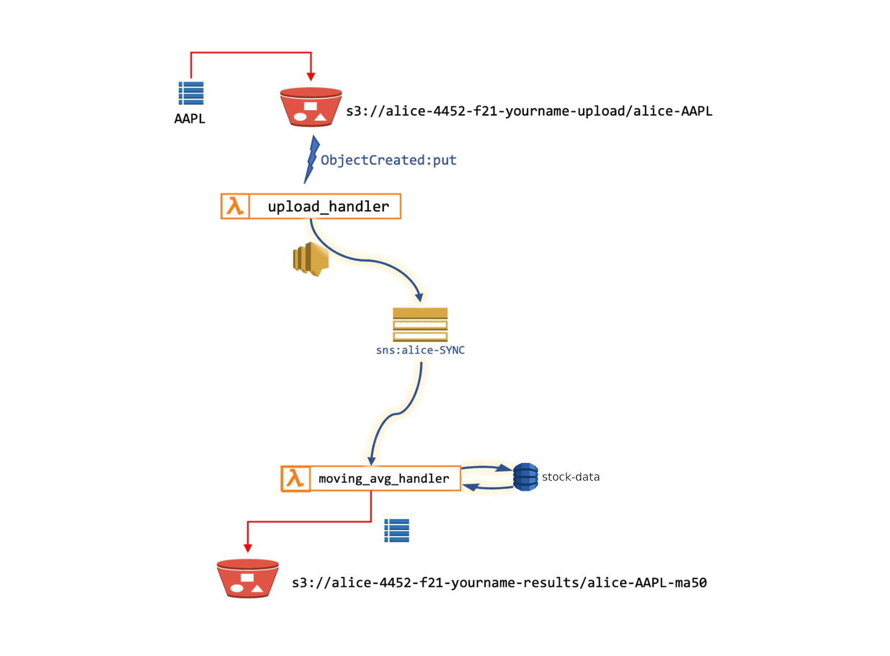

# Simple Moving Average (SMA) Calculator
#### Description
An automated, cloud-based Simple Moving Average calculator which allows users to upload a valid CSV file containing stock data to an S3 bucket. The data will be processed by the program infrastructure as seen below, and then the resulting Simple Moving Average data will be outputted into a results S3 bucket.

#### Infrastructure Constraints
* **Simple Queue Service (SQS)** and AWS services *other than* SNS may not be used.
* **Simple Notification Service (SNS)** topic must publish the contents of the input file line-by-line to the moving average handler lambda function as opposed to sending all the data in the file at once.

#### Infrastructure Diagram
This program makes use of various AWS services. The high-level steps of the program are as follows:

* A `user-application program` (or the users themselves) uploads a valid CSV file of stock data to the `primary-upload S3 bucket`.
* The upload triggers the `Lambda Upload Handler` which parses the triggering file line-by-line and publishes each line to the `Sync SNS topic`.
* The `Sync SNS topic` forwards the data to the `Lambda Moving Average handler`.
* The `Lambda Moving Average handler` sends the data to a `DynamoDB table` for persistent storage.
* Once all of the data are uploaded, the `Lambda Moving Average handler` queries the data from the `DynamoDB table`, calculates the Simple Moving Average, outputs the result to a CSV file, and then sends the CSV file to the `output-results S3 bucket`.




## Guide
#### Requirements
This program requires the AWS Command Line Interface and Boto3.
```
pip3 install -r requirements.txt
```

#### Creating Infrastructure
Prepare and create the initial infrastructure of this program.
```
python3 run.py create
```

#### Deleting Infrastructure
Cleanup and delete the infrastructure once done to keep AWS account tidy and avoid additional charges.
```
python3 run.py destroy
```
